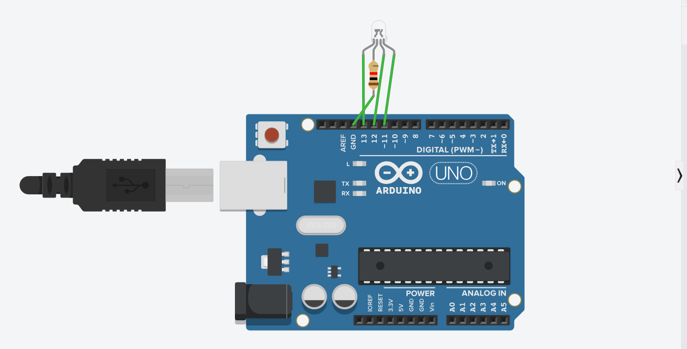

# rgb_led_project
RGB LED CONTROL USING ARDUINO
# RGB LED Control using Arduino

## Description

This project demonstrates how to control an RGB LED using Arduino.

## Components Used

* Arduino Uno
* RGB LED
* Resistor
* Jumper wires

##  Working

The Arduino uses PWM signals to control Red, Green, and Blue pins, producing different colors.

##  Circuit Diagram

##  Code

The code is available here: [project.ino](project.ino)

## Applications

* Decorative lighting
* Electronics learning

##  Author

HimagnaMovva27
